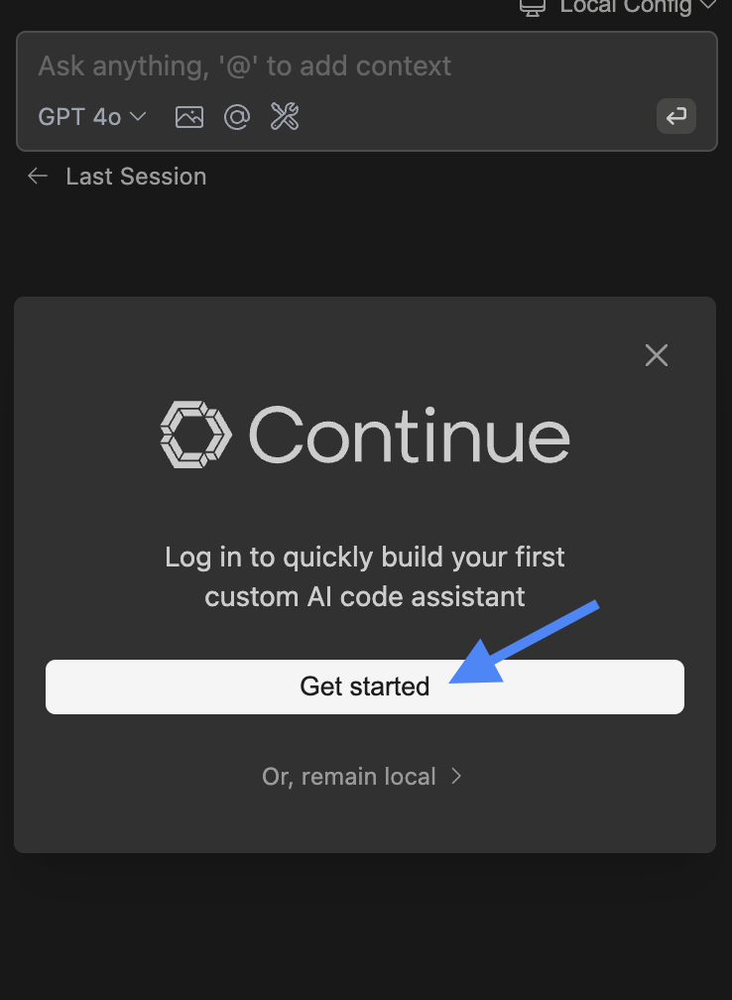

<iframe
  width="100%"
  height="400"
  src="https://www.youtube.com/embed/gjekTru4Cg4"
  title="安装 Continue VS Code 扩展"
  frameborder="0"
  allow="accelerometer; autoplay; clipboard-write; encrypted-media; gyroscope; picture-in-picture"
  allowfullscreen
></iframe>

<Tabs>
<Tab title="VS Code">

<Steps>
<Step title="从 Marketplace 安装">
点击 [Visual Studio Marketplace 中的 Continue 扩展页面](https://marketplace.visualstudio.com/items?itemName=Continue.continue) 上的 `Install`
</Step>

<Step title="在 VS Code 中安装">
  这将在 VS Code 中打开 Continue 扩展页面，您需要再次点击 `Install`
</Step>

<Step title="移至右侧边栏">
Continue 图标将出现在左侧边栏上。为了获得更好的体验，将 Continue 移至右侧边栏

</Step>

<Step title="登录">
[登录 Mission Control](https://auth.continue.dev/) 开始使用
</Step>
</Steps>

<Info>
  如果您遇到任何问题，请查看 [故障排除指南](/troubleshooting) 或在 [我们的 Discord](https://discord.gg/NWtdYexhMs) 中寻求帮助
</Info>

</Tab>

<Tab title="JetBrains">

<Steps>
<Step title="打开设置">
打开您的 JetBrains IDE 并使用 `Ctrl` + `Alt` + `S` 打开 **设置**
</Step>

<Step title="查找 Continue 插件">
  在侧边栏选择 **插件**，然后在市场中搜索 "Continue"
</Step>

<Step title="安装插件">
点击 `Install`，这将使 Continue 图标显示在右侧工具栏上

</Step>

<Step title="登录">
[登录 Mission Control](https://auth.continue.dev/) 开始使用
</Step>
</Steps>

<Info>
  如果您遇到任何问题，请查看 [故障排除指南](/troubleshooting) 或在 [我们的 Discord](https://discord.com/invite/EfJEfdFnDQ) 中寻求帮助
</Info>

</Tab>
</Tabs>

## 登录

点击 "Get started" 登录 Mission Control 并开始使用。

