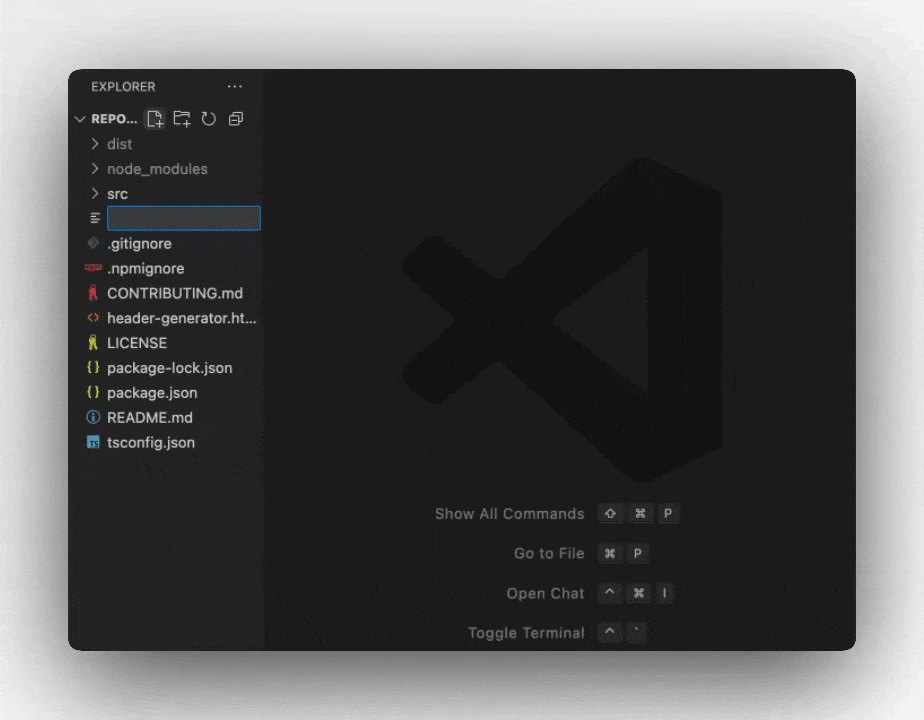
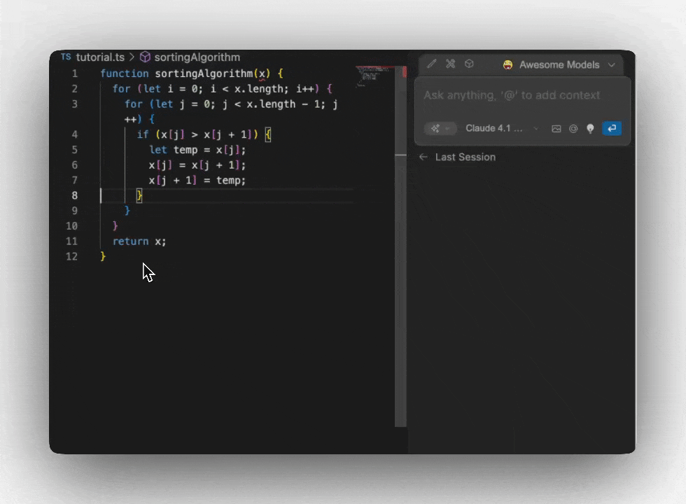
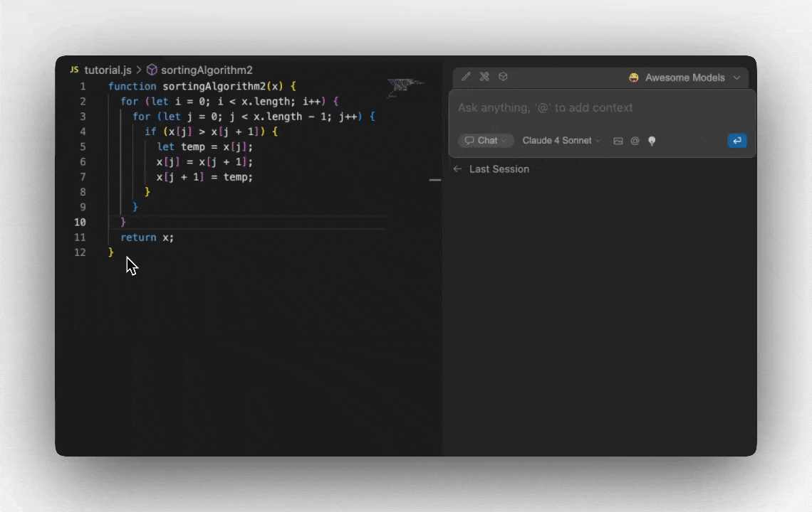
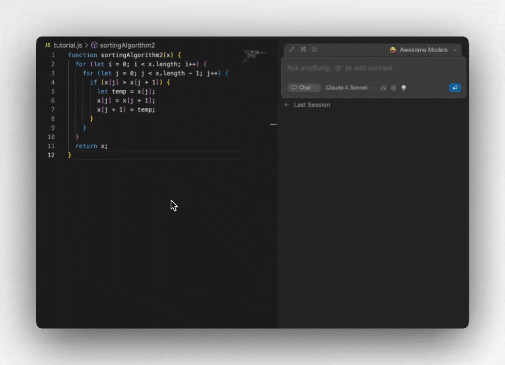

欢迎使用 Continue！本交互式教程将通过实际示例引导您了解所有四个核心功能。按照步骤操作，深入了解 Continue 的功能。

<Info>
  **前提条件**：确保您已经 [安装了 Continue](/ide-extensions/install) 并 [登录](https://auth.continue.dev/) 才能开始使用。
</Info>

---

## 🔄 自动补全

**功能**：在您输入时提供智能的内联代码建议，由 AI 驱动。

<Steps>
<Step title="创建测试文件">
在您的 IDE 中创建一个名为 `tutorial.js` 的新文件（或使用您喜欢的任何语言）
</Step>

<Step title="尝试自动补全">
复制以下起始代码，并将光标放在注释的末尾：

```javascript
// TODO: Implement a sorting algorithm function
function sortingAlgorithm(arr) {
  // 在此处放置光标并按 Enter
}
```

按 **Enter** 键，观察 Continue 建议的代码补全。按 **Tab** 键接受建议。

</Step>

<Step title="见证奇迹">
Continue 将根据上下文和注释智能地建议函数实现。
</Step>
</Steps>

<Tip>
  当您提供清晰的函数名称、注释或类型注解来表达您的意图时，自动补全效果最佳。
</Tip>

---



## ✏️ 编辑

**功能**：使用自然语言指令对特定代码部分进行快速、有针对性的更改。

<Steps>
<Step title="添加示例代码">
将以下冒泡排序实现粘贴到您的文件中：

```javascript
function sortingAlgorithm(x) {
  for (let i = 0; i < x.length; i++) {
    for (let j = 0; j < x.length - 1; j++) {
      if (x[j] > x[j + 1]) {
        let temp = x[j];
        x[j] = x[j + 1];
        x[j + 1] = temp;
      }
    }
  }
  return x;
}
```

</Step>
<Step title="高亮函数">
在编辑器中 **高亮** 整个函数
</Step>

<Step title="打开编辑模式">按 **Cmd/Ctrl + I** 打开编辑模式</Step>

<Step title="给出指令">
  输入：`"make this more readable and add TypeScript types"`
</Step>

<Step title="见证奇迹">
  观察 Continue 自动重构您的代码！
</Step>

<Step title="查看更改">
Continue 将显示建议更改的差异。根据需要接受或拒绝个别更改。
</Step>
</Steps>

<Note>
  编辑功能非常适合重构、添加文档、修复错误或在不同语言/框架之间转换。
</Note>



## 💬 聊天模式

**功能**：交互式 AI 助手，可以分析代码、回答问题并提供指导，无需离开您的 IDE。

<Steps>
<Step title="添加另一个函数">
将以下第二个排序函数添加到您的文件中：

```javascript
function sortingAlgorithm2(x) {
  for (let i = 0; i < x.length; i++) {
    for (let j = 0; j < x.length - 1; j++) {
      if (x[j] > x[j + 1]) {
        let temp = x[j];
        x[j] = x[j + 1];
        x[j + 1] = temp;
      }
    }
  }
  return x;
}
```

</Step>
<Step title="开始对话">
1. **高亮** 该函数
2. 使用下面的键盘快捷键将其添加到聊天中。
3. 提问：`"What sorting algorithm is this and how can I optimize it?"`
</Step>

<Step title="进一步探索">
尝试这些后续问题：
- `"Show me how to implement quicksort instead"`
- `"What's the time complexity of this algorithm?"`
- `"Can you write unit tests for this function?"`
</Step>
</Steps>

### 聊天模式键盘快捷键

<Tabs>
<Tab title="VS Code">

**Cmd/Ctrl + L**  
新建聊天 / 使用选定代码新建聊天 / 如果聊天已聚焦则关闭 Continue 侧边栏

**Cmd/Ctrl + Shift + L**  
聚焦当前聊天 / 将选定代码添加到当前聊天 / 如果聊天已聚焦则关闭 Continue 侧边栏

</Tab>
<Tab title="JetBrains IDEs">

**Cmd/Ctrl + J**  
新建聊天 / 使用选定代码新建聊天 / 如果聊天已聚焦则关闭 Continue 侧边栏

**Cmd/Ctrl + Shift + J**  
聚焦当前聊天 / 将选定代码添加到当前聊天 / 如果聊天已聚焦则关闭 Continue 侧边栏

</Tab>
</Tabs>

<Tip>
  使用聊天功能进行代码审查、调试帮助、学习新概念或 brainstorming 复杂问题的解决方案。
</Tip>




---

## 🤖 代理模式

**功能**：一个自主的编码助手，可以读取文件、进行更改、运行命令并处理复杂的多步骤任务。

<Steps>
<Step title="切换到代理模式">
1. 打开 Continue 面板
2. 点击输入框左下角的 **下拉菜单**
3. 选择 **"Agent"** 模式
</Step>

<Step title="给代理模式一个复杂任务">
  尝试这个提示：``` "Write comprehensive unit tests for the sorting functions
  in this file. Create the tests in a new file using Jest, and make sure to test
  edge cases like empty arrays and single elements." ```
</Step>

<Step title="观察代理模式工作">
代理模式将：
- ✅ 分析您现有的代码
- ✅ 创建一个新的测试文件
- ✅ 编写全面的测试
- ✅ 处理设置和导入
- ✅ 解释每一步的操作
</Step>
</Steps>

<Warning>
  代理模式具有强大的功能，包括文件创建和修改。在接受代理模式的更改之前，请务必仔细审查。
</Warning>



---
## 探索更多扩展示例

准备好探索更多了吗？Continue 提供了五个强大的功能来增强您的编码工作流：
<Tabs>
<Tab title="代理模式">
[代理模式](/ide-extensions/agent/quick-start) 为聊天模型配备了处理各种编码任务所需的工具


<Info>
  了解更多关于 [代理模式](/ide-extensions/agent/quick-start)
</Info>
</Tab>

<Tab title="聊天模式">
[聊天](/ide-extensions/chat/quick-start) 让您可以轻松地向 LLM 寻求帮助，而无需离开 IDE


<Info>
  了解更多关于 [聊天模式](/ide-extensions/chat/quick-start)
</Info>
</Tab>

<Tab title="计划">
[计划](/ide-extensions/agent/plan-mode) 提供了一个安全的环境，带有只读工具，用于探索代码和规划更改


<Info>
  了解更多关于 [计划模式](/ide-extensions/agent/plan-mode)
</Info>
</Tab>

<Tab title="编辑">
[编辑](/ide-extensions/edit/quick-start) 是一种方便的方式，可以在不离开当前文件的情况下修改代码


<Info>
  了解更多关于 [编辑](/ide-extensions/edit/quick-start)
</Info>
</Tab>

<Tab title="自动补全">
[自动补全](/ide-extensions/autocomplete/quick-start) 在您输入时提供内联代码建议


<Info>
  了解更多关于 [自动补全](/ide-extensions/autocomplete/quick-start)
</Info>
</Tab>
</Tabs>

## 🚀 下一步

恭喜！您已经体验了 Continue 的所有四个核心功能。以下是接下来可以探索的内容：

<CardGroup cols={2}>
  <Card title="自定义您的设置" icon="gear" href="/customize/overview">
    配置模型、添加上下文提供程序并个性化您的工作流
  </Card>
  <Card
    title="高级功能"
    icon="rocket"
    href="/ide-extensions/agent/quick-start"
  >
    深入了解代理模式的功能和高级用例
  </Card>
  <Card
    title="模型提供商"
    icon="brain"
    href="/customize/model-providers/overview"
  >
    连接您首选的 AI 模型和提供商
  </Card>
  <Card
    title="加入社区"
    icon="users"
    href="https://discord.gg/NWtdYexhMs"
  >
    获取帮助并与其他 Continue 用户分享经验
  </Card>
</CardGroup>

---

## 📚 功能深入

准备好掌握特定功能了吗？查看这些详细指南：

<AccordionGroup>
  <Accordion title="自动补全深入">
    了解 [配置自动补全模型](/customize/model-roles/autocomplete)、[微调建议](/customize/deep-dives/autocomplete) 和 [常见问题排查](/troubleshooting)。
  </Accordion>

<Accordion title="聊天和代理模式最佳实践">
  发现 [有效的提示技术](/customize/deep-dives/prompts)、[hub 与本地配置](/guides/understanding-configs) 以及 [自定义斜杠命令](/customize/deep-dives/prompts)。
</Accordion>

  <Accordion title="企业和团队">
    探索 [Hub 配置](/hub/configs/intro)、[组织管理](/hub/governance/creating-an-org) 和 [共享配置](/hub/sharing)。
  </Accordion>
</AccordionGroup>

<Info>
  **需要帮助？** 查看我们的 [故障排除指南](/troubleshooting) 或在我们的 [社区讨论](https://github.com/continuedev/continue/discussions) 中提问。
</Info>
